# LOG430 Architecture logicielle

# Objectif principal

L'objectif principal de ce projet de cours est de proposer un système de comparaison de temps de trajet basée sur une architecture de microservices. Ce système permettra de comparer les temps de trajets entre les autobus et les automobiles **pour les étudiants qui veulent se rendre à leurs cours de LOG430 à l'ÉTS**.  Il sera réalisé au travers d'un seul laboratoire de 36 heures au total. Les spécifications des exigences portent sur l'analyse, la conception et l'implantation de ce système. Ce projet sera réalisé selon un seul livrable, qui devra être validé régulièrement auprès du chargé de laboratoire. Ce livrable comprendra les objectifs d'affaires, les cas d'utilisation, les scénarios de qualité priorisés, des vues architecturales permettant de démonter chacune des tactiques, une ou plusieurs vues de modules, une ou plusieurs vus composants et connecteurs, une ou plusieurs vues d'allocation.  

# Le contexte de l'organisation

Vous êtes nouvellement embauché par l'organisation LOG430STM pour développer le système de comparateur de trajet.  La réussite de ce projet n'est pas optionnelle. La carrière des étudiants peut grandement être impactée s'ils échouent à ce cours. C'est pour cette raison que l'organisation a décidé de séparer les responsabilités selon les différentes [parties prenantes.](#parties-prenantes-du-projet)


# Le comparateur de trajet

Vous devez développer l'architecture d'un système de comparaison de temps de trajet en utilisant les données temps réel de la STM disponible sur le site suivant: https://www.stm.info/fr/a-propos/developpeurs et les donnés fournie par des [services externes](#services-externes)

# Services externes

Utiliser l'API ou la page web des fournisseurs externe pour l'estimation en temps réel du temps nécessaire pour parcourir la distance de la résidence des étudiants vers l'ETS.  P-S N'utilisez pas vos adresse personnelle exacte pour les tests et démonstration. 

## Exemples
- https://www.google.ca/maps/dir/Marché+Jean-Talon/45.51433,+-73.55014/45.58927,+-73.50912/@45.5503686,-73.5965441,13z/data=!3m2!4b1!5s0x4cc919136bb582b5:0xf0b087b71589c626!4m20!4m19!1m5!1m1!1s0x4cc919136130849d:0x5c1098d838d87981!2m2!1d-73.6148902!2d45.5361095!1m5!1m1!1s0x0:0xf12664c8f968830d!2m2!1d-73.5502413!2d45.514437!1m5!1m1!1s0x0:0xfeb4b67d79e8fa7c!2m2!1d-73.5091582!2d45.589417!3e0

## Fournisseurs potentiels
- google map
- https://www.viamichelin.com/web/Routes
- https://en.mappy.com/itineraire
- https://ca.bonnesroutes.com
- Waze
- BingMaps 
- en.mappy.com
- Ajouter vos suggestions…

# Parties prenantes du projet
## Chargé de laboratoire (client)
- Effectuera l'évaluation de l'architecture de chaque équipe (Documentation, Intégration et Implémentation)
- Responsable de répondre aux questions des étudiants (durant les périodes de laboratoire seulement)
- Responsable d'aider les étudiants à maîtriser les concepts d'architecture
- Veux un rapport détaillé de l'architecture et des interfaces

## Classe
- Chaque classe est séparée en deux cohorte

## cohorte
- Chaque cohorte est séparé en équipe de 5 étudiants.
- Les équipes de chaque cohorte peuvent partager leurs microservices avec toutes les équipes de la cohorte pour permettre aux autres équipes de faire de l'intégration au lieu de faire de l'implémentation.  Utiliser l'intégration pour satisfaire une exigence est plus payant en termes de point.  Voir le ficher de la grille de correction.
- Le chargé de cours crée les cohortes.

## Équipe (Étudiants)
- L'équipe doit concevoir et réaliser une architecture qui satisfait **toutes** les exigences.
- Je recommande à l'équipe d'utiliser les microservices implémentés par les autres équipes puisque c'est 2 fois plus payant en termes de points accumulés. Voir la [grille de pointage](#grille-de-pointage) pour plus d'information.
- Un étudiant par équipe est nommé pour faire partie de l'équipe de coordination 
  - Une équipe peut révoquer son représentant de l'équipe de coordination s'il ne répond pas à leurs attentes 
- L'équipe doit conserver une traçabilité de quel étudiant est responsable de quelles tâches. Ceci correspond à une vue d'allocation à insérer dans votre rapport.
- L'équipe doit connaître en tout temps l'état d'une tâche assignée à un étudiant
- L'équipe a la responsabilité de concevoir/documenter et diffuser (à l'équipe de coordination) la documentation des interfaces des microservices qui leur ont été assignés.
- Le chargé de cours crée les équipes de laboratoires.
### S20231 Équipe
- Nous avons comme objectif de créer une banque de microservice qui pourra être utilisé pour les laboratoires de LOG430 des prochaines sessions.  Vous trouverez donc dans chaque répertoire des microservices, un fichier README.md qui demande l'autorisation des étudiants pour une licence de droit d'utilisation.  Aucune pénalité ne sera appliquée si une équipe décide de ne pas accorder cette licence.

## Équipe de coordination
- L'équipe de coordination est  responsable de répartir équitablement les tâches de réalisation de la conception et l'implémentation des différents microservices nécessaire à ce projet.
- L'équipe de coordination gère les droits d'accès/d'utilisation des équipes aux intégrations réalisées par les autres équipes.
  - Dois conserver une trace écrite pour savoir quelle équipe implémente quel microservice.
- L'équipe a la responsabilité de valider et de diffuser la documentation des interfaces touchant aux composants implémentés/utilisés par plusieurs équipes. 
  - Une version d'interface publiée ne peut pas être changée. Vous devez obligatoirement publier une nouvelle version.
  - L'équipe de coordination peut exiger qu'il y ait simultanément plusieurs versions d'un même microservice en marche
- L'équipe de coordination peut démettre de ses fonctions un étudiant qui ne répond pas à ses attentes. 
  - L'équipe affectée devra nommer un nouveau représentant
- Les équipes de coordination ne doivent pas travailler ensemble ils sont des compétiteurs

## Contraintes de réalisation
### Language¶
Nous n’imposons aucune contrainte au niveau du langage de développement utilisé à l'exception que celui-ci doit être de type **Orienté objet**.

### Réalisation
Vous devez réaliser votre projet avec des **microservices**. Prenez note que nous vous fournissons un répertoire de microservices ayant déja été utilisé pour faire ce laboratoire. Vous pouvez utiliser ces microservices ou développer vos propres microservices.

### Contrainte d'équipe
L'équipe de coordonnateur peut imposer aux équipes les contraintes quelle juge nécessaires pour le bon déroulement du projet. 

# Grille de pointage
Voir la [grille de pointage](doc/grille-pointage.xlsx) pour connaître le nombre de points associé à chacun des artéfacts que vous réaliserez durant ce projet.

Le nombre normal d'étudiants dans une équipe est de 5 personnes. 

La note finale de chaque équipe sera pondérée en fonction du nombre d'étudiants dans l'équipe.

La note finale de chaque équipe sera pondérée en fonction des notes de toutes les équipes de toutes les classes.

## Directives pour la planification

L'équipe de coordination répartit la charge de travail au niveau des équipes et indique clairement (avec document à l'appui) ses attentes par rapport à chaque équipe.

L'équipe de coordonnateur et les équipes doivent utiliser le Kanban de Github pour planifier et réaliser le projet.
Vos Kanban doivent avoir au minimum les colonnes suivantes:
  - **backlog**: idée générique de tâches à considérer, priorisée par l'équipe.
  - **todo**: ce qu'on fait à la prochaine itération, à faire, assignée explicitement ou non.
  - **in progress**: tâches sur lesquels vous travaillez présentement. Généralement, une seule tâche par étudiant
  - **review**: les tâches qui doivent être révisées par un autre étudiant de l'équipe.  Idéalement sous forme de pull request.
  - **Done**: le pull request a été accepté et la tâche est terminée.


## Directive d'implémentation

La coordination et l'échange d'information entre les équipes deviennent cruciaux pour le bon succès de votre projet. 

L'équipe qui développe un microservice qui sera intégré par d'autres équipes doit s'assurer de la robustesse de son microservice. Le microservice doit satisfaire les attributs de qualité associée à celui-ci. 

Ces microservices doivent être déployés par l'équipe propriétaire ou l'équipe de coordonnateur.

## Directive d'intégration

Chaque équipe doit implémenter sa propre solution tout en réalisant l'intégration avec des microservices développés par d'autres [équipes](#équipe-étudiants). 

Vous devrez clairement démontrer comment vous faites l'intégration des composants développés par les autres équipes.  L'utilisation de diagramme de séquence et de diagramme de composant est particulièrement adaptée à ce besoin.


## Directive de déploiement
Vous pouvez déployer votre solution sur n'importe quel serveur. Dans le cadre du laboratoire nous vous fournirons l'accès à un serveur virtuel utilisant l'interface [Portainer](#déploiement-avec-portainer).  Ce serveur vous permettra de déployer des microservices réalisés à l'aide de docker et docker-compose.

### Déploiement avec Portainer

Voir les vidéos:
- portainer-1: https://youtu.be/L0ak_Jsi3W8  teste en mode local
- portainer-2: https://youtu.be/VSxIHf0ZuF0  Deployement sur Portainer
- portainer-3: https://youtu.be/1vDqsMESGyI  Docker-compose sur Portainer

### Déploiement avec Heroku (option)
  - [Déploiement avec Heroku](doc/deploiement/Déploiement-Tutoriel-Docker-Heroku.md)

## Directive de Démonstration
- Vous n'aurez droit qu'à une seule démonstration pour l'intégration et/ou l'implémentation de chaque exigence. 
- Chaque équipe disposera d'un maximum de 10 minutes par démonstration/exigence.
- Donc soyez bien préparé
  - Assurez-vous d'avoir testé vos microservices individuellement et dans le système
  - Assurez-vous de ne pas faire des modifications de dernières minutes qui pourraient impacter votre démonstration
- À chaque démonstration, le chargé de laboratoire peut vous demander de créer des issues que vous devrez avoir satisfaites lors de la démonstration subséquente.  Le non-respect de cette directive pourrait entrainer des pertes de points.
 
## Directives de vérification de la documentation
Une attention particulière sera portée sur les éléments suivants au niveau de votre documentation d'architecture:
1. Le stéréotype de chaque élément dans un diagramme est bien identifié
2. Les interfaces sont explicites dans les diagrammes et documentées en fonction du type d’interface.  
3. Chaque interface doit être adéquatement détaillée dans un fichier séparé.
4. Les choix technologiques sont visibles dans les vues architecturales. 
5. Chaque diagramme possède un texte explicite pour le décrire.  Ne décrivez pas chaque élément du diagramme, vous le ferez dans le tableau des éléments. Nous voulons savoir à quoi sert ce diagramme, quelle est son utilité, qu'est-ce qu'il permet de comprendre ou de démontrer.
6. Chaque diagramme possède une légende
7. La relation entre les vues est facilement compréhensible.
8. Les relations entre les cas d'utilisation et les éléments de votre architecture sont bien documentées. 
9. La relation entre les attributs de qualité et les tactiques de votre architecture sont bien documentées.
10. La relation entre les tactiques et les éléments de votre architecture sont bien documentés. 
11. Les tactiques sont clairement visibles et bien documentées dans les vues architecturales. 
   1. Les propriétés associées aux tactiques sont bien documentées.
12. Vous utilisez des liens pour toute référence à de l'information se trouvant dans le document
13. Votre rapport contient au moins une vue de module. 
14. Votre rapport contient au moins une vue de C&C. 
15. Votre rapport contient au moins une vue d'allocation.
   2. Assignation des tâches
   3. Déploiement
16. Votre rapport contient des diagrammes de séquence/activité pour démontrer le comportement des composants dans la réalisation des différentes tactiques.
17. Vous vous êtes assuré de la correspondance entre la documentation d’architecture et votre implémentation.
18. **Vos diagrammes indiquent clairement quels sont les composants intégrés versus ceux qui sont développés par votre équipe.**

## Directives pour les remises

Vous devez utiliser le document suivant pour la documentation de votre architecture: [DocumentationArchitecture.md](doc/documentationArchitecture.md)

Toutes les remises se font directement sur le répertoire Github de votre équipe, sur la branche principale [«main»]. Assurez-vous que votre rapport est situé dans le répertoire DOC, qu'il est au format PDF et se nomme [documentationArchitecture.pdf](doc/documentationArchitecture.pdf) .

Utiliser la commande suivante pour générer le PDF de la documentation avec l'outil [Pandoc](https://pandoc.org)
```bash
pandoc documentationArchitecture.md vues-module.md footer.md vues-cetc.md footer.md vues-allocation.md footer.md oa1.md footer.md  oa2.md footer.md cu01.md footer.md cu02.md footer.md cu03.md footer.md cu04.md footer.md cu05.md footer.md cu06.md footer.md cu07.md footer.md cu08.md footer.md cu09.md footer.md cu10.md footer.md AQ-disponibilite.md footer.md AQ-modifiabilite.md footer.md AQ-performance.md footer.md AQ-securite.md footer.md AQ-testabilite.md footer.md AQ-usabilite.md footer.md AQ-interoperabilite.md footer.md -o documentationArchitecture.pdf && open documentationArchitecture.pdf
```

Vous devez mettre votre documentation et vos sources à jour dans la branche main, et ensuite vous générez un tag correspondant à l'itération ou vous faites votre remise. **Les remises doivent se faire avant la séance de laboratoire correspondant à la semaine identifié dans le tableau suivant**.

| Semaine   |Tag                 |Évaluation durant cette remise |  
| --------: |:-------------------|-------------------------------|
|         4 | git tag itération1 |La documentation des cas d’utilisation et attributs de qualité, aucune démonstration    |
|         8 | git tag iteration2 |La documentation des interfaces et le fonctionnement des composants développé par l'équipe |
|         12| git tag iteration3 |La documentation des 3 vues architecturales et le fonctionnement du système complet |


# Parasites et mollasson
À la fin de la session, les membres de l'équipe devront réaliser une évaluation par les pairs pour chacun des membres de l'équipe. La note finale du laboratoire de ce membre sera pondérée par rapport à cette évaluation. Référez-vous à l'article Parasites et mollasson pour vous aider à faire l'évaluation des autres étudiants. Voir les [fichiers Excel d'évaluation par les pairs](docs/../doc/EvaluationParLesPairs-etudiant1.xlsx) dans le répertoire DOC. 

N'oubliez pas que cette clause du plan de cours s'applique à chaque itération et sera appliquée avant l'évaluation par les pairs. **Un étudiant ou une étudiante dont le nom n'est pas sur un travail de laboratoire reçoit une note de "0" pour le travail.**

# Bonus projet laboratoire (5% point bonus)
Impressionnez-nous en intégrant de nouvelles fonctionnalités / Apis offrant de nouveaux services ou interagissant avec de nouveaux services externes.


 # Documentation des interfaces
Les catalogues d'élément devraient être des tableaux qui contiennent la description des éléments en plus d'un lien vers la documentation de l'interface de ceux-ci.
Je vous suggère d'utiliser un document par interface pour vous faciliter la tâche. Il sera ainsi plus facile de distribuer la documentation d'une interface aux équipes en ayant besoin.
La documentation des interfaces de vos éléments doit se faire en utilisant le [gabarit suivant](template-interface.md).

Voici quelques exemples de documentation d'interface utilisant ce gabarit:
- https://wiki.sei.cmu.edu/confluence/display/SAD/OpcPurchaseOrderService+Interface+Documentation
- https://wiki.sei.cmu.edu/confluence/display/SAD/OpcOrderTrackingService+Interface+Documentation
- https://wiki.sei.cmu.edu/confluence/display/SAD/WebServiceBroker+Interface+Documentation


## Relation entre les éléments architecturale et les exigences de qualité

Dans les diagrammes de séquence, vous devez faire le lien entre l'exigence et le participant ainsi qu'identifier le type de l'élément.  Est-ce un module (classe), un composant, un connecteur ou une interface?

- \<\<cu01>> correspond à l'exigence qui requiert cet élément
- \<\<composant>> correspond au type de l'élément
- ChaosMonkey correspond au nom de l'élément ou de l'interface

```plantuml
@startuml
skinparam style strictuml
participant "<<cu01>>\n<<Composant>>\n:ChaosMonkey" as monkey


@enduml

```


# S20232 
Chaque équipe doit réaliser une documentation d'architecture ainsi qu'une implémentation/intégration pour les critères suivants:

## Disponibilité
1. Redondance Active avec détection par vote (TMR)
2. Redondance passive avec ping/Echo ou heartbeat
3. Spare avec monitor et predictive model

## Performance
1. Limit event response avec maintain multiple copies of computation
2. Introduce concurrency

## Securité
- Detect service denial attack
  - [Quick guide: simulating a DDoS attack in your own lab](https://www.keysight.com/us/en/assets/7019-0414/technical-overviews/Simulating-a-DDoS-Attack-in-Your-Own-Lab.pdf)
  - Identify Actor
  - Authenticate Actor
  - Authenticate Actor
  - Lock computer for 5 min

## Testability
- Sandbox
- Record/playback

## Usability
- Maintain system model for administrator

## Interopérability
  - service discovery
  - 
