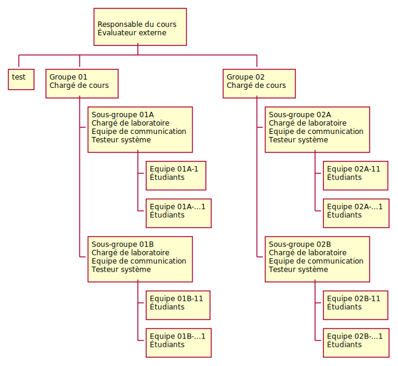
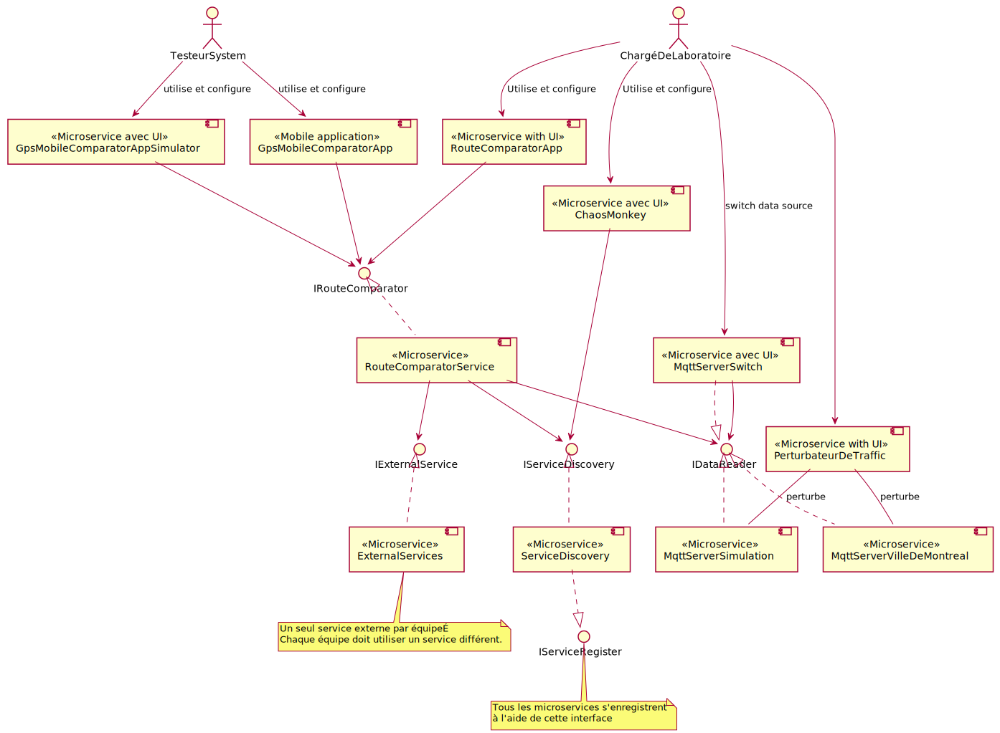

# LOG430 - Architecture logicielle¶
- [LOG430 - Architecture logicielle¶](#log430---architecture-logicielle)
  - [Gestion des versions](#gestion-des-versions)
  - [Introduction](#introduction)
- [Contexte d'affaires](#contexte-daffaires)
  - [Objectifs](#objectifs)
  - [API de la ville de Montréal](#api-de-la-ville-de-montréal)
    - [Données de simulation](#données-de-simulation)
    - [Objectifs d'affaires](#objectifs-daffaires)
- [Le contexte de l'organisation](#le-contexte-de-lorganisation)
  - [Partie prenante](#partie-prenante)
    - [Chargé de cours (client)](#chargé-de-cours-client)
    - [Chargé de laboratoire (client)](#chargé-de-laboratoire-client)
    - [Classe](#classe)
    - [Sous-groupe](#sous-groupe)
    - [Équipe (Étudiants)](#équipe-étudiants)
    - [Équipe de coordination (Architectes)](#équipe-de-coordination-architectes)
- [Cas d'utilisation](#cas-dutilisation)
  - [Acteurs](#acteurs)
    - [ChargéDeLaboratoire](#chargédelaboratoire)
      - [CU01. Veux comparer les temps de trajet:](#cu01-veux-comparer-les-temps-de-trajet)
      - [CU02. Veut pouvoir mettre le chaos dans les services en](#cu02-veut-pouvoir-mettre-le-chaos-dans-les-services-en)
      - [<s>CU03. Contrôle source de données</s>](#scu03-contrôle-source-de-donnéess)
      - [CU04. Perturbateur de trafic](#cu04-perturbateur-de-trafic)
      - [CU05. Simulation donnée GPS](#cu05-simulation-donnée-gps)
      - [CU06. Simulation usager multiple](#cu06-simulation-usager-multiple)
- [Attribut de qualité](#attribut-de-qualité)
  - [Disponibilité](#disponibilité)
      - [AQD1. Monitorage](#aqd1-monitorage)
      - [AQD2. Ping/écho,](#aqd2-pingécho)
      - [AQD3. Heartbeat](#aqd3-heartbeat)
      - [AQD4. Redondance passive](#aqd4-redondance-passive)
      - [ADQ5. Redondance active](#adq5-redondance-active)
  - [Modifiabilité:](#modifiabilité)
      - [AQM1. Modifier sélection et intersection.](#aqm1-modifier-sélection-et-intersection)
      - [AQM2. Interface avec autre équipe](#aqm2-interface-avec-autre-équipe)
      - [AQM3. Généralisation redondance passive](#aqm3-généralisation-redondance-passive)
      - [AQM4. Généralisation redondance active](#aqm4-généralisation-redondance-active)
  - [Testabilité:](#testabilité)
      - [AQT1. Interface spécialisée](#aqt1-interface-spécialisée)
      - [AQT2. Abstraire, source de données.](#aqt2-abstraire-source-de-données)
      - [AQT3. "Limiter opération non déterministe"](#aqt3-limiter-opération-non-déterministe)
      - [AQT4. Record/playback](#aqt4-recordplayback)
      - [AQT5. Gestion centralisée des logs + id message](#aqt5-gestion-centralisée-des-logs--id-message)
  - [Convivialité:](#convivialité)
      - [AQU1. UI](#aqu1-ui)
      - [AQU2. Aggregation](#aqu2-aggregation)
  - [Performance](#performance)
      - [AQP1. Optimisation sur la latence](#aqp1-optimisation-sur-la-latence)
      - [AQP2. 1000 clients](#aqp2-1000-clients)
  - [Interopérabilité:](#interopérabilité)
      - [AQI1. Utilisation des microservices des autres équipes](#aqi1-utilisation-des-microservices-des-autres-équipes)
      - [AQI2. Découverte dynamique de service](#aqi2-découverte-dynamique-de-service)
  - [Sécurité](#sécurité)
      - [AQS1. Authentification](#aqs1-authentification)
      - [AQS2. Maintain audit trail](#aqs2-maintain-audit-trail)
- [Contraintes](#contraintes)
  - [Language¶](#language)
- [Planification des itérations](#planification-des-itérations)
    - [Processus de remises](#processus-de-remises)
    - [À vérifier avant votre remise](#à-vérifier-avant-votre-remise)
- [Documentation de l'architecture](#documentation-de-larchitecture)
  - [Suggestion d'outils](#suggestion-doutils)
    - [notion.so](#notionso)
    - [confluence](#confluence)
    - [Google doc](#google-doc)
  - [Rapports](#rapports)
  - [Rapport Test Système (Itération 3 seulement)](#rapport-test-système-itération-3-seulement)
- [Directives d'implémentation](#directives-dimplémentation)
- [Directive de déploiement](#directive-de-déploiement)
  - [Hébergement possible](#hébergement-possible)
- [Démonstration](#démonstration)
- [Critères d'évaluation](#critères-dévaluation)
  - [Grille de correction](#grille-de-correction)
  - [Collaboration](#collaboration)
- [Proposition d'architecture](#proposition-darchitecture)
    - [Légende](#légende)
  - [Composants](#composants)
  - [Services externes](#services-externes)
    - [Exemples](#exemples)
    - [Fournisseurs potentiels](#fournisseurs-potentiels)
  - [Bonus projet laboratoire (15% point bonus)](#bonus-projet-laboratoire-15-point-bonus)
  - [Charge de laboratoire](#charge-de-laboratoire)

## Gestion des versions
|Date   |Description de la mise à jour|
|-------   |-----------|
|2022-01-11|Enlever MQTT, ajouter microservice manquant: TimeTravelCalculator et TrafficMonitoring. Améliorer la description des CU et AQ|
|2021-12-29| Intégration de l'énoncé de laboratoire dans GIT. Refonte du diagramme de proposition|

**J'utilise le code de couleur suivant**
    - vert: nouveaux éléments/documentation, 
    - orange: élément/documentation modifié, 
    - rouge :  élément ou documentation enlevée.
## Introduction
Dans le cadre de ce projet, on cherche à créer une application de calcul de temps de trajet se servant de différents microservices. La partie de l'application qui reçoit les requêtes de temps de trajet est aussi un microservice. 

Pour débuter votre projet, nous vous fournissons la documentation sommaire d'une architecture de référence. Vous pouvez apporter toutes les modifications nécessaires à cette architecture pour permettre de satisfaire les exigences clients.

# Contexte d'affaires
La ville de Montréal commence à se démarquer des grandes villes mondiales par le développement de son pôle d’intelligence artificielle. La concentration d’entreprises et d’universités qui unissent leurs efforts en intelligence artificielle fait de Montréal un pôle de savoir qui rayonnera rapidement à un niveau mondial. ¶

Dans le cadre de cet effort, Montréal veut se positionner comme une des villes les plus intelligentes du monde. Pour ce faire, elle met à disposition des entreprises un ensemble d’Apis ouvertes permettant d’accéder en temps réel aux différents capteurs répartis aux quatre coins de la ville. 

## Objectifs
Dans le cadre de ce projet, vous devrez donc utiliser les données de ces capteurs en temps réel pour améliorer la précision des algorithmes de calcul du temps nécessaire pour parcourir un itinéraire.

## API de la ville de Montréal
- [Montréal investit plus de 10 M$ dans son système de transports intelligents](http://ville.montreal.qc.ca/portal/page?_pageid=5798,42657625&_dad=portal&_schema=PORTAL&id=26179)

Analyser les interfaces (API) de la plateforme de la ville de Montréal pour l’accès aux données en temps réel au niveau des capteurs sur le réseau routier à partir du site Websocket Client (from Paho).

Prenez note que ce service est temporairement hors service.  Vous devez développer votre système et le connecter avec ce service lorsqu'il redeviendra actif.
### Capteurs
Liste des capteurs sur une carte
https://www.google.com/maps/d/u/0/edit?mid=1Xm1J7Zuwp0Ra5GGbws8C4N7WcuNMT3M-&ll=45.5176601142996%2C-73.51752064002218&z=14

### Données de simulation
[Données pour le simulateur](https://etsmtl365-my.sharepoint.com/:f:/g/personal/cc-yvan_ross_etsmtl_ca/EuBXHT0WSBJIpCtkbpf2dzMBwvMT8JCjBkWjkS6dUEIG-w)

Prenez note que votre solution calculera les temps de trajet uniquement entre deux points sur la rue Notre-Dame.

Ces algorithmes permettent de fournir une information pertinente/précise aux systèmes d’intelligence artificielle qui aideront à gérer la ville pour permettre aux citoyens d’obtenir une meilleure qualité de vie.¶

### Objectifs d'affaires
- OA-1. Rendre le laboratoire intéressant pour les étudiants.
- OA-2. Permettre aux étudiants de constater l'importance de l'architecture logicielle.
- OA-3. Faciliter le recrutement des nouveaux chargés de laboratoire.
- OA-4. Faciliter le processus de correction des laboratoires.
- OA-5. Arrimer le laboratoire (pratique) et le cours (théorique)
- OA-6. Faire expérimenter le travail d'architecte logiciel aux étudiants.
- OA-7. Amériorer la qualité de vie des citoyens de la ville de Montréal

# Le contexte de l'organisation
Vous êtes nouvellement embauché par l'organisation LOG430 pour développer le projet de Ville intelligente.  La réussite de ce projet n'est pas optionnelle. La carrière des étudiants peut grandement être impactée s'ils échouent ce cours. C'est pour cette raison que l'organisation a décidé de séparer les responsabilités selon les parties prenantes suivantes :

## Partie prenante

### Chargé de cours (client)
- Effectuera l'évaluation du rapport de test système sur le terrain (4 équipes de terrain, 2 équipes par groupe)
- L'évaluation ne doit pas prendre plus de 15 minutes par équipe
### Chargé de laboratoire (client)
- Effectuera l'évaluation de l'architecture de chaque équipe
- Responsable de répondre aux questions des étudiants
- Responsable d'aider les étudiants à maîtriser les concepts d'architecture
- Veux un rapport détaillé de l'architecture et des interfaces

### Classe
- Chaque classe est séparée en deux sous-groupes distincts

### Sous-groupe 
- Chaque sous-groupe est séparé en équipe de 5 étudiants.
- Chaque sous-groupe doit démontrer que son architecture est meilleure que celle des autres sous-groupes. Inclus les sous-groupes de l'autre classe qui sont considérés comme des compétiteurs.

### Équipe (Étudiants)
- Le chargé de cours crée les équipes de laboratoires.
- **À chaque itération**, un étudiant par équipe est nommé pour faire partie de l'équipe de coordination (bonis de 5% de la note de laboratoire de l'équipe)
  - Un étudiant ne peut pas être coordonnateur plus d'une itération.
  - Une équipe peut révoquer son représentant de l'équipe de coordination s'il ne répond pas à leurs attentes 
    - Cet étudiant n'obtiendra pas son bonus de 5% pour la participation à l'équipe de coordination et sera pénalité de 5% sur sa note de laboratoire
- Doit conserver une traçabilité de quel étudiant est responsable de quelles tâches
- Dois connaître en tout temps l'état d'une tâche assignée à un étudiant
- Ont la responsabilité de concevoir l'architecture permettant de satisfaire aux exigences client
- Ont la responsabilité de concevoir/documenter et diffuser (à l'équipe de coordination) la documentation des interfaces des microservices qui leur ont été assignés.
- Ont la responsabilité d'implémenter les microservices
- Ont la responsabilité de tester leur implémentation
- Ont la responsabilité d'intégrer leurs microservices avec les microservices des autres équipes pour obtenir une application permettant de satisfaire aux exigences clients.
- Chaque étudiant est conjointement et solidairement responsable des livrables.¶

### Équipe de coordination (Architectes)
- Cette équipe est responsable de l'architecture globale du système
- Cette équipe a la responsabilité de valider et de diffuser la documentation des interfaces touchant aux composants implémentés par plusieurs équipes. 
  - Une version d'interface publiée ne peut pas être changée. Vous devez obligatoirement publier une nouvelle version.
- L'équipe de coordination peut démettre de ses fonctions un étudiant qui ne répond pas à ses attentes. 
  - Cet étudiant n'obtiendra pas son bonus de 5% pour la participation à cette équipe et sera pénalité de 5% sur sa note de laboratoire
  - L'équipe affectée devra nommer un nouveau représentant
- Les deux équipes de coordination ne doivent pas travailler ensemble ils sont des compétiteurs
- L'Équipe de coordination est aussi responsable de répartir équitablement les tâches de réalisation de la conception et l'implémentation des différents microservices nécessaire à ce projet.
- Ils ont la responsabilité de faire l'intégration de tous les microservices pour réaliser l'application qui satisfait aux exigences client.
- Dois conserver une trace écrite pour savoir quelle équipe implémente quel microservice.
- Je vous suggère fortement de faire implémenter chaque microservice par au moins 2 équipes pour assurer une certaine disponibilité des microservices durant le laboratoire.  
# Cas d'utilisation

## Acteurs
### ChargéDeLaboratoire
#### CU01. Veux comparer les temps de trajet: 
  1. le CL sélectionne une intersection de départ et une intersection d'arrivée, ainsi que le taux de rafraichissement de la prise de mesure.
  2. Le CL sélectionne les sources de données qu'il veut utiliser. Externe ou de simulation.
  3. Le système affiche un graphique du temps de déplacement et met celui-ci à jour selon le taux de rafraichissement.
  4. Le CL peut récupérer le fichier de données et générer ses propres graphiques à l'aide d’Excel.

#### CU02. Veut pouvoir mettre le chaos dans les services en
  - **Option 1**: Manuel
    1.1. Le CL consulte la liste des microservices avec leur latence moyenne.
    1.2. Le CL change la latence d'un ou plusieurs microservices.
  
  - **Option 2**: Automatique
    2.1. Le CL sélectionne le mode automatique tout en spécifiant la fréquence de la perturbation en seconde.
    2.2. Le système détruit1 un microservice de façon aléatoire a toute les x secondes.
  
  - Le système conserve un log des différents changements apportés que nous pourrons utiliser pour vérifier les données accumulées.

> ##### Cas alternatifs
>  - 1.2.a Le CL détruit un ou plusieurs microservices.
>  - 1.2.b Le CL détruit tous les microservices d'une équipe.

#### <s>CU03. Contrôle source de données</s>
<s>Veux contrôler manuellement ou par programmation le fait d'utiliser les données réel ou de simulation.</s>
#### CU04. Perturbateur de trafic
Veux pouvoir perturber le trafic à l'aide d'une interface usager pour simuler un accident ou une période de pointe sur les données de simulation.
1. Le CL indique la date et heure de début de la perturbation.
2. Le CL indique le type1 et la durée de la perturbation ainsi que la ou les intersections perturbées.
3. Le système perturbe les données de simulation.
4. Le système affiche le graphique du temps de trajet en temps réel.

Note 1: Type de perturbation
  - fermeture d'une voie de circulation
  - en diminution ou  augmentation la vitesse de la circulation 

#### CU05. Simulation donnée GPS
Veux utiliser une ou plusieurs applications pour envoyer les positions GPS et faire le calcul du temps de trajet en temps réel;
1. Le CL sélectionne l'intersection de départ et de destination, il indique la vitesse moyenne qu'il veut simulée ainsi que la fréquence à laquelle il veut une mise à jour des données graphiques.
2. Le CL sélectionne le ou les services externes qu'il désire utiliser.
3. Le système lui indique le temps de trajet estimé s'il n'y a aucune perturbation de trafic.
4. Le CL démarre la simulation.
5. Le système affiche un graphique représentant le temps de trajet de chaque service externe en temps réel.

#### CU06. Simulation usager multiple
Simulation du CU05 avec 100 véhicules simultanés ayant tous des vitesses de déplacement différentes (répartie aléatoirement).

Désactiver l'affichage graphique en temps réel et utiliser l'archivage des données pour permettre la réalisation de différents graphiques sur Excel. 

Refaire la même simulation en utilisant le CU04 pour perturber le trafic.

# Attribut de qualité
## Disponibilité
#### AQD1. Monitorage
Vous devez implémenter un mécanisme de monitorage pour tous les microservices. 
#### AQD2. Ping/écho,
chaque microservice doit supporter le mode écho (écho).
#### AQD3. Heartbeat
chaque microservice doit supporter le mode heartbeat.
#### AQD4. Redondance passive
Vous devez implémenter une redondance passive sur le microservice TravelTimeCalculator.
  > 1. Démarrer 1 instance de TravelTimeCalculator qui sera utilisée comme point de référence.
  > 2. Démarrer 1 instance active et une instance passive de TravelTimeCalculator.
  > 3. Démarer 1 instance active et une instance passive de TravelTimeCalculator.
  > 4. Afficher le graphique des temps de trajet de ces deux microservices.
  > 5. Utiliser CU02 pour détruire l'instance active de TravelTimeCalculator.
  > 6. Démonter que la simulation est maintenant réalisée par le microservice passif qui est devenu actif. 
  > 7. Démontrer que votre système redémarre une nouvelle instance du serveur passif.
  
  > **refaire** l'étape #3 lorsque le serveur passif est opérationnel.

#### ADQ5. Redondance active
Vous devez implémenter une redondance active sur le microservice TimeTravelCalulator  .
  > 1. Démarrer une instance de TimeTravelCalculator en configuration de redondance active.
  > 1. Utiliser CU02 pour détruire une des instances du mécanisme de redondance active.
  
## Modifiabilité: 
#### AQM1. Modifier sélection et intersection.
Vous devez être en mesure de modifier les intersections utilisées (ajoutez ou retrait) seulement en modifiant un fichier de configuration ou à l'aide de l'interface usager.  L’application des changements à votre solution ne devrait pas prendre plus de 15 secondes.
#### AQM2. Interface avec autre équipe
Vous devez être en mesure d’adapter votre solution pour utiliser les microservices d'une autre équipe en moins d'une heure.
#### AQM3. Généralisation redondance passive
Démontrer que vous êtes en mesure de généraliser la redondance passive pour n'importe quel composant en moins d'une heure. 
> 1. Quand vous êtes prêt, montrer la liste des microservices que vous avez développés au chargé de laboratoire.
> 1. Démontrer au chargé de laboratoire que vous avez implémenté des tactiques architecturales vous permettant de facilement généraliser la redondance passive.
> 1. Le chargé de laboratoire choisi un microservice.
> 1. Vous avez une heure pour lui montrer que vous avez implémenté la redondance passive pour ce microservice.
#### AQM4. Généralisation redondance active
 Démontrer que vous êtes en mesure de généraliser la redondance active pour n'importe quel composant en moins de 3 heures.
> 1. Quand vous êtes prêt, montrer la liste des microservices que vous avez développés au chargé de laboratoire.
> 1. Démontrer au chargé de laboratoire que vous avez implémenté des tactiques architecturales vous permettant de facilement généraliser la redondance active.
> 1. Le chargé de laboratoire choisi un microservice.
> 1. Vous avez une heure pour lui montrer que vous avez implémenté la redondance passive pour ce microservice.

## Testabilité: 
#### AQT1. Interface spécialisée
Démonter que vous utilisez la tactique "Interface spécialisée" pour permettre de modifier dynamiquement la latence des microservices de votre architecture.
#### AQT2. Abstraire, source de données.
Démontrer que vous utilisez la tactique "Abstraire la source de données" pour spécifier les sources de donnée.
#### AQT3. "Limiter opération non déterministe"
Démontrer que vous utilisez la tactique "Limiter opération non déterministe" pour faciliter l'exécution de vos tests. Surtout avec les données de simulation
#### AQT4. Record/playback
Démonter que vous utilisez la tactique « Record/playback » pour pouvoir tester à nouveau votre système avec des données déjà reçues.
Démonter que le playback fonctionne.
#### AQT5. Gestion centralisée des logs + id message
Démontrer que vous utilisez la tactique "Interface spécialisée" pour suivre à la trace tous les messages entrant dans les microservices par l'association d'un numéro unique à chaque message entrant.  Ceci devrait permettre de faire la trace de tous les microservices actifs ayant été utilisés pour traiter un message.

## Convivialité: 
#### AQU1. UI
Utiliser des interfaces usager au lieu de fichier de configuration pour faciliter la configuration de vos microservices.
#### AQU2. Aggregation
Utilisez la tactique "Aggregation" pour applique des commandes ou configuration à de multiples microservices ou intersection simultanément.
  
## Performance
#### AQP1. Optimisation sur la latence
Vous devez être en mesure de configurer votre système pour utiliser les microservices ayant les plus faibles latences pour réaliser le calcul du temps de trajet. Sont inclus les microservices développés par toutes les équipes de votre sous-groupe.
#### AQP2. 1000 clients
Proposer un scénario de performance pour que votre système soit en mesure de supporter 1000 clients simultanément en utilisant les données des services externes.   
  - Démontrez **mathématiquement** que la solution proposée est réalisable. 
  - Vous devez documenter cette solution sans en faire l'implémentation.  
  
## Interopérabilité:
#### AQI1. Utilisation des microservices des autres équipes
Vous devez pouvoir utiliser les services fournis par les autres équipes du laboratoire uniquement en modifiant dynamiquement la configuration de votre système.
#### AQI2. Découverte dynamique de service
Votre système devrait pour récupérer la liste des microservices qu'il a besoin pour s'acquitter de sa tâche et d'utiliser ceux-ci dynamiquement.
## Sécurité
#### AQS1. Authentification
Vous devez mettre en place un mécanisme pour que votre service ne soit accessible que pour les équipes autorisées.
#### AQS2. Maintain audit trail
Appliquer la tactique "Maintain audit trail" dans un service centralisé pour faciliter la détection de tentative non autorisée de connexion. Vous devriez enregistrer l'adresse IP de l'appelant pour chaque tentative.
  
# Contraintes
## Language¶
Nous n’imposons aucune contrainte au niveau du langage de développement utilisé.

# Planification des itérations

L'équipe de coordination répartit la charge de travail au niveau des équipes et indique clairement (avec document à l'appui) ses attentes par rapport à chaque équipe.

Je vous recommande d'utiliser un outil de suivi des tâches. 
  - Trello
  - Github issue
  - todoist
  - etc.
  - Notion task list
  
[## Réalisation des itérations
Le projet doit être divisé en 3 itérations distinctes.  

Chaque itération compte pour 15% de la note globale.
  - 10% sont associés à la documentation de l'architecture
  - 5% sont associés à la démonstration

Notez que le calendrier des séances est différent pour chaque groupe-cours, mais les dates de remises suivent cette planification. Le rapport doit être prêt pour la démo afin de montrer la correspondance entre la conception et la solution.

| Itération |Démo/Rapport   |
| --------: |:--------------|
|         1 |Début séance 4|
|         2 |Début séance 8|
|         3 |Début séance 12|

<!-- Ce point est essentiel pour le BCAPG, car on mesure la partie «évaluation» des rapports -->

### Processus de remises
Toutes les remises se font directement sur le répertoire Github de votre équipe, sur la branche principale [«main» ou «master»]. Assurez-vous que votre rapport est au format PDF.

Toutes les remises se font directement dans Github. Vous devez mettre vos sources à jour dans la branche master, et ensuite vous générer un tag correspondant à votre remise. Voir le tableau suivant pour savoir quel tag générer selon votre remise.

Prenez note que tous les rapports en format markdown doivent aussi être remis sous le format PDF.

| Itération |Rapport           |
| --------: |:-----------------|
|         1 | git tag rapport1 |     
|         2 | git tag rapport2 |
|         3 | git tag rapport3 |

### À vérifier avant votre remise
Une attention particulière sera portée sur les éléments suivants au niveau de votre documentation d'architecture:
1. Le stéréotype des éléments est bien identifié
2. Les interfaces sont explicites dans les diagrammes et documentées en fonction du type d’interface.  
3. Chaque interface doit être adéquatement détaillée dans un fichier séparé.
4. Les choix technologiques visibles dans les vues architecturales. 
5. Chaque diagramme possède un texte explicite pour le décrire.  Ne décrivez pas chaque élément du diagramme, vous le ferez dans le tableau des éléments. Nous voulons savoir à quoi sert ce diagramme, quelle est son utilité, qu'est ce qu'il nous permet de comprendre ou démontrer. Chaque vue architecturale. 
6. La relation entre les vues facilement compréhensibles.
7. La relation entre les éléments et cas d'utilisation bien documentée. 
8. La relation entre les tactiques et les scénarios d'attributs de qualité est bien documentée.
9. La relation entre les éléments et les tactiques bien documentée. 
10. Les tactiques sont clairement visibles et bien documentées dans les vues architecturales. 
   1. Les propriétés associées aux tactiques sont bien documentées.
11. Vous utilisez des liens pour toute référence à de l'information se trouvant dans le document
12. Votre rapport contient au moins une vue de module. (Itération 2 et 3)
13. Votre rapport contient au moins une vue d'allocation.
   2. Assignation des tâches à toutes les itérations
   3. Déploiement à l'itération #2 et #3.
14. Votre rapport contient au moins un diagramme de séquence/activité pour démontrer la mécanique de redondance passive lors d’un crash (itération 2 et/ou 3).
15. Votre rapport contient au moins un diagramme de séquence/activité pour démontrer la mécanique de redondance active lors d’une augmentation de la latence. (itération 2 et/ou 3)
16. Vous vous êtes assuré de la correspondance entre la documentation d’architecture et votre implémentation.

# Documentation de l'architecture 

Toutes les équipes d'un sous-groupe doivent utiliser les mêmes outils de documentation. L'équipe de coordination est responsable de gérer l'utilisation des outils, de définir et gérer le processus de réalisation de la documentation.

## Suggestion d'outils
### notion.so
https://notion.so/
ÉTAPES POUR ÊTRE ENREGISTRÉ DANS LA DOCUMENTATION NOTION
1. Créer un compte notion avec votre adresse Google de l'ÉTS @etsmtl.net
2. Associer votre compte notion à un compte équipe
2.0. pour complété l'étape 2 entrée sur l'interface de notion authentifier avec votre compte google
2.1.  sélectionner l'onglet Settings & Members dans notion
2.2. Cliquer l'onglet Plans
2.4. Scroll passer la table de prix
2.3. Cliquer le bouton Activate Student plan
3. Mettre votre courriel etsmtl.ca ici pour qu'on vous ajoute à l'espace de documentation 

### confluence
confluence.com

### Google doc
googledoc.com

## Rapports
Une attention particulière sera portée sur les éléments suivants au niveau de votre documentation d'architecture:
  [Voir section à vérifier avant votre remise](#à-vérifier-avant-votre-remise)
  
À chaque itération, on doit pouvoir facilement visualiser quels sont les éléments ajoutés, modifiés ou enlevés de votre documentation.  
  - Utiliser un code de couleur. 
    - vert: nouveaux éléments/documentation, 
    - orange: élément/documentation modifié, 
    - rouge: élément ou documentation enlevée.

## Rapport Test Système (Itération 3 seulement)
- Documentation du processus de test
- Documentation des résultats de test
- Introduction/Conclusion

# Directives d'implémentation
Voici quelques directives qui ont fait leurs preuves lorsque les étudiants les respectent.
- Chaque microservice doit être implémenté par au moins 2 équipes pour obtenir de la redondance et garantir une certaine disponibilité.
- Réaliser un diagramme de classe avant de débuter votre implémentation.
- Débuter votre implémentation par la classe ayant le moins de couplage.
- Utiliser TDD comme processus d’implémentation. 
- Assurez-vous d’avoir une très bonne couverture de test.
- Terminer votre implémentation d’un cas d’utilisation par la classe contrôleur et ensuite par la classe route.
- Assurez-vous d’utiliser une classe de route pour chaque contrôleur pour maximiser la cohésion.
- Utiliser Github issu pour faire le suivie des tâches à réaliser. 
  - Il faut que chaque membre de l’équipe puisse clairement identifier les tâches qu’il a à faire, et ce en tout temps. 
  - Installer l'extension «GitHub Pull Requests and Issues» dans visual studio code
- Utilisez des outils pour mesurer les métriques de qualité de code et assurez-vous que votre code est de bonne qualité.  
  - L'extension «Tech Debt Metrics» dans visual studio code
  - L'extension «SonarLint» dans visual studio code

# Directive de déploiement
Vous êtes libre d'utiliser l'environnement de déploiement que vous désirez. Nous vous suggérons de faire le maximum de test possible en mode local avec des outils comme:
  - Docker
  - Docker-compose

Vous n'êtes pas obligé de déployer tous vos microservices en externe.  Vous pouvez utiliser les outils suivants pour rendre publique l'adresse de vos microservices locale:
- [whatismyip](https://www.whatismyip.com)
- [ngrok](https://ngrok.com)
- [Vortex?](https://www.vortexhub.io/public-urls?gclid=CjwKCAjw0qOIBhBhEiwAyvVcf2SZKqrNeJ5PqFHrHztXuwIM3XPWqvgAVGLYuOA9lcht30x-EDunDxoCuwUQAvD_BwE)
- [ngrok alternative](https://www.softwaretestinghelp.com/ngrok-alternatives/)

## Hébergement possible
- alwaysdata.com gratuit 100Mo
- heroku.com gratuit 500Mo

Voir le [tutoriel](Déploiement-Tutoriel-Docker-Heroku.md) de déploiement sur héroku.
# Démonstration
- Chaque équipe disposera d'un maximum de 25 minutes pour démontrer la réalisation des cas d'utilisation et des attributs de qualité.
- Une fonctionnalité non démontrée dans une itération pourra être démontrée à l'itération suivante tout en respectant le maximum de 25 minutes.
- Donc soyez bien préparé
  - Assurez-vous d'avoir testé vos microservices individuellement et dans le système
  - Assurez-vous de ne pas faire des modifications de dernières minutes qui pourraient impacter votre démonstration
- À chaque démonstration, le chargé de laboratoire peut vous demander de créer des issues que vous devrez avoir satisfaites lors de la démonstration subséquente.
  
# Critères d'évaluation
Les membres de l'équipe ayant réalisé un travail peuvent décider de ne pas mettre sur le rapport le nom d’un ou de plusieurs autres membres qui n'ont pas fait une **contribution significative** (analyse et conception) à l’itération. **Avant la remise** du travail, un courriel doit être envoyé en copie conforme à tous les membres de l’équipe, à l'étudiant visé, aux chargés de laboratoire ainsi qu’à l’enseignant pour indiquer les raisons du retrait du nom. Un membre de l'équipe dont son nom n'est pas sur un travail de laboratoire reçoit une note de "0" pour le travail.

## Grille de correction
Cette grille de correction n'est pas encore à jour....
https://docs.google.com/spreadsheets/d/1mL5DOAUfjton08JkEBc-5Q21kq-4FYdu/edit?usp=sharing&ouid=115008909369430627351&rtpof=true&sd=true

## Collaboration
Cette grille inclut des critères d'évaluation de la collaboration entre les équipes de coordination et les équipes.  Les évaluations seront fournies par l'équipe de coordination.
  - Qualité des échanges avec les équipes
  - Qualité des rétroactions des équipes

# Proposition d'architecture
Dans le but d'aider les équipes de coordonnateur à démarrer le projet le plus rapidement possible, je vous fournis une ébauche de solution que vous devez compléter. Celle-ci devrait vous permettre de planifier la distribution des tâches initiale du projet.  Vous devez apporter toutes les modifications nécessaires à cette proposition et l'utiliser comme point de départ.  

### Légende
- Composant en vert:  Nouveau microservice pour cette itération.  cu05
- Composant en blues: Composant modifié dans le cadre de cette itération
- Composant en rouge: Composant détruit durant cette itération

## Composants
| Composant | Description |
| ---|--|
|ChargéDeLaboratoire|Doit pouvoir vérifier chacune des exigences client le plus rapidement possible|
|GpsAppSimulator|Simulation de l'application pour la transmission des coordonnées GPS|
|RouteComparatorApp|Microservice permettant d'afficher les courbes de comparaison de données|
| ChaosMonkey| Générateur de chaos qui peut modifier la latence ou détruire un microservice selon différents critères.  Doit aussi pouvoir détruire/faire arrêter/planter/terminer le processus de ServiceDiscovery pour que celui soit temporairement non disponible. Référence.: https://principlesofchaos.org |
|RouteComparatorService| Comparateur des calculs du temps de trajet entre deux coordonnées GPS. Le calcul se fait sur le tronçon de la rue Notre-Dame seulement. |
|ServerSwitch | Commutateur permettant de fournir les données de simulation ou les données en temps réel. Devrait aussi permettre de sélectionner un serveur de simulation particulier|
|PerturbateurDeTraffic|Élément perturbant le trafic pour voir l'impact sur le temps total de trajet. Ex.: Fermer une voie, modifier la vitesse, etc.
|ExternalService|Service externe permettant de calculer le temps de trajet entre deux points GPS|
|ServiceDiscovery| Microservice permettant d'enregistrer et de découvrir la liste des microservices actifs pour pouvoir obtenir leurs services | 
|ServerSimulation | Serveur simulant le serveur de la ville de Montréal et utilisant les données de simulation|
|RouteComputationService | Serveur permettant de faire le calcul des données de chacune des intersections pour permettre d'obtenir le temps de trajet entre deux points sur la rue Notre-Date|
|TrafficMonitoring | Microservice permettra d'afficher et d'archiver en temps réel les données de temps de trajet sous forme de graphique avec lignes multiples |

## Services externes
Utiliser l'API ou la page web des fournisseurs externe pour l'estimation en temps réel du temps nécessaire pour parcourir la distance entre deux points sur le boulevard Notre-Dame
### Exemples
- https://www.google.ca/maps/dir/45.58927,-73.50912/45.51577,+-73.55196/@45.5541942,-73.5686356,13z/am=t/data=!3m1!4b1!4m7!4m6!1m0!1m3!2m2!1d-73.55196!2d45.51577!3e0
- https://www.google.ca/maps/dir/45.51433,+-73.55014/45.58927,+-73.50912/@45.5519338,-73.5641068,13z/data=!3m1!4b1!4m10!4m9!1m3!2m2!1d-73.55014!2d45.51433!1m3!2m2!1d-73.50912!2d45.58927!3e0

### Fournisseurs potentiels
- google map
- https://www.viamichelin.com/web/Routes
- https://en.mappy.com/itineraire
- https://ca.bonnesroutes.com
- Waze
- BingMaps 
- en.mappy.com
- Ajouter vos suggestions…
## Bonus projet laboratoire (15% point bonus)
Impressionnez-nous en intégrant de nouvelles fonctionnalités / Apis offrant de nouveaux services ou interagissant avec de nouveaux services externes.

## Charge de laboratoire
- Vous êtes intéressé par une charge de laboratoire de LOG430. Contactez-nous le plus rapidement possible.

