# LOG430 Architecture logicielle

# Objectif des laboratoires

L'objectif principal des 4 laboratoires du cours de LOG430 est de vous permettre de maitriser les concepts d'analsyses et de conception d'une architecture logicielle d'un système complexe. Cette architecture sera développé sur la base d'une architecture de microservices. Le système fourni offre un service permettant de faire la comparaison de temps de trajet à partir de donneés sur les autobus de la STM et de services externe fournissant des données sur les automobiles. 

# 4 laboratoires (30% de la note finale, 40% implémentation/60% documentation)
## Laboratoire #1 #1 (3 semaines, 25%)
  - Intégration des mécaniques de télémétrie

## Laboratoire #2 #2 (3 semaines, 25%) 
  - Réalisation de tactiques de disponibilité
  - ChaosMonkey détruit aléatoirement les conteneurs de calcul

## Laboratoire #3 (3 semaines, 25%)
    - Réalisation des tactiques de performance
    - ChaosMonkey s'attaque aux connecteurs (message queue, bus, etc.)
    - Chaosmonkey attaque à la limitation du nombre d'instruction par secondes
    - ChaosMonkey s'attaque à la mémoire disponible pour les containers
  
## Laboratoire #4 (3 semaines, 25%)
    - ChaosMonkey s'attaque au Data store (BD, cache, etc.)
      

# Le contexte de l'organisation

Vous êtes nouvellement embauché par l'organisation LOG430STM pour améliorer l'architecture du comparateur de trajet.  La réussite de ce projet n'est pas optionnelle. La carrière des étudiants peut grandement être impactée s'ils échouent à ce cours. C'est pour cette raison que l'organisation a décidé de séparer les responsabilités selon les différentes [parties prenantes.](#parties-prenantes-du-projet)

# Parties prenantes du projet
## Chargé de laboratoire (client)
- Effectuera l'évaluation de l'architecture de chaque équipe (Documentation, Intégration et Implémentation)
- Responsable de répondre aux questions des étudiants (durant les périodes de laboratoire seulement)
- Responsable d'aider les étudiants à maîtriser les concepts d'architecture
- Veux un rapport détaillé de l'architecture et des interfaces

## Équipe (3 Étudiants)
- L'équipe doit conserver une traçabilité de quel étudiant est responsable de quelles tâches. Ceci correspond à une vue d'allocation à insérer dans votre rapport.
- L'équipe doit connaître en tout temps l'état d'une tâche assignée à un étudiant
- Le chargé de cours crée les équipes de laboratoires.

## Contraintes de réalisation
### Language¶
Nous n’imposons aucune contrainte au niveau du langage de développement utilisé à l'exception que celui-ci doit être de type **Orienté objet**.

## Directives pour la planification

Les équipes doivent utiliser le Kanban de Github pour planifier et réaliser le projet.
Vos Kanban doivent avoir au minimum les colonnes suivantes:
  - **backlog**: idée générique de tâches à considérer, priorisée par l'équipe.
  - **todo**: ce qu'on fait à la prochaine itération, à faire, assignée explicitement ou non.
  - **in progress**: tâches sur lesquels vous travaillez présentement. Généralement, une seule tâche par étudiant
  - **review**: les tâches qui doivent être révisées par un autre étudiant de l'équipe.  Idéalement sous forme de pull request.
  - **Done**: le pull request a été accepté et la tâche est terminée.

Ces données serviront pour la réalisation d'une vue de type allocation.

## Directive de déploiement
Vous devez déployer vos solutions de chaque itération sur docker desktop sur votre propre ordinateur. 

## Directive de Démonstration
- Vous n'aurez droit qu'à une seule démonstration pour l'intégration et/ou l'implémentation de chaque exigence. 
- Chaque équipe disposera d'un maximum de 10 minutes par démonstration/exigence.
- Donc soyez bien préparé
  - Assurez-vous d'avoir testé votre architecture
  - Assurez-vous de ne pas faire des modifications de dernières minutes qui pourraient impacter votre démonstration
- À chaque démonstration, le chargé de laboratoire peut vous demander de créer des tâches que vous devrez avoir satisfaites lors de la démonstration subséquente.  Le non-respect de cette directive pourrait entrainer des pertes de points.

## Directive de remise 

Vous devez mettre vos sources à jour dans la branche main, et ensuite vous générez un tag correspondant à l'itération ou vous faites votre remise. **Les remises doivent se faire avant minuit le jour de la séance de laboratoire correspondant à la semaine identifié dans le tableau suivant**.

Les rapports devront être remis dans Moodle.

| Semaine   |Tag                 | Rapport |
| --------: |:-------------------|------|
|         3 | git tag laboratoire-1 | Remise dans Moodle|
|         6 | git tag laboratoire-2 | Remise dans Moodle |
|         9 | git tag laboratoire-3 | Remise dans Moodle |
|        12 | git tag laboratoire-4 | Remise dans Moodle |

* Il y aura des directives supplémentaires pour la remise de la documentation de chaque itération.
### Laboratoire #1
Assurez-vous que votre rapport est situé dans le répertoire laboratoire1, qu'il est au format PDF et se nomme [laboratoire1-rapport.pdf](laboratoire1/laboratoire1.pdf)

### Laboratoire #2,3 et 4
Vous devez utiliser le document suivant pour la documentation de votre architecture: [DocumentationArchitecture.md](doc/documentationArchitecture.md)

Utiliser la commande suivante pour générer le PDF de la documentation avec l'outil [Pandoc](https://pandoc.org)
```bash
pandoc documentationArchitecture.md vues-module.md footer.md vues-cetc.md footer.md vues-allocation.md footer.md oa1.md footer.md  oa2.md footer.md cu01.md footer.md cu02.md footer.md cu03.md footer.md cu04.md footer.md cu05.md footer.md cu06.md footer.md cu07.md footer.md cu08.md footer.md cu09.md footer.md cu10.md footer.md AQ-disponibilite.md footer.md AQ-modifiabilite.md footer.md AQ-performance.md footer.md AQ-securite.md footer.md AQ-testabilite.md footer.md AQ-usabilite.md footer.md AQ-interoperabilite.md evaluationParLesPairs.md footer.md -o documentationArchitecture.pdf && open documentationArchitecture.pdf
```

## Relation entre les éléments architecturale et les exigences de qualité

Dans les diagrammes de séquence, vous devez faire le lien entre l'exigence et le participant ainsi qu'identifier le type de l'élément.  Est-ce un module (classe), un composant, un connecteur ou une interface?

- \<\<cu01>> correspond à l'exigence qui requiert cet élément
- \<\<composant>> correspond au type de l'élément
- ChaosMonkey correspond au nom de l'élément ou de l'interface

```plantuml
@startuml
skinparam style strictuml
participant "<<cu01>>\n<<Composant>>\n:ChaosMonkey" as monkey


@enduml

```


# Parasites et mollasson
À la fin de chaque laboratoire, les membres de l'équipe doivent réaliser leur propre évaluation par les pairs pour chacun des membres de l'équipe.  Référez-vous à l'article Parasites et mollasson pour vous aider à faire l'évaluation des autres étudiants. Voici en référence un exemple de [fichiers Excel d'évaluation par les pairs](docs/../doc/EvaluationParLesPairs-etudiant1.xlsx) dans le répertoire DOC. Vous pouvez utiliser ce fichier pour faire vos évaluations par les pairs. Vous devez indiquer clairement dans votre rapport de laboratoire le résultats de cette évaluation et spécifie si nous appliquons celui-ci à la note de votre laboratoire.

