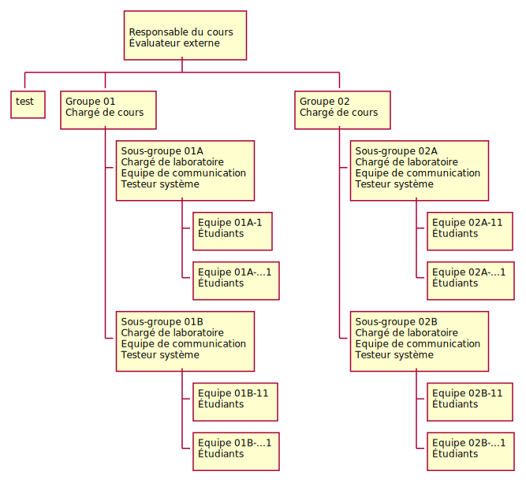

## Partie prenante

### Chargé de laboratoire (client)
- Effectuera l'évaluation de l'architecture de chaque équipe
- Responsable de répondre aux questions des étudiants
- Responsable d'aider les étudiants à maîtriser les concepts d'architecture
- Veux un rapport détaillé de l'architecture et des interfaces

### Classe
- Chaque classe est séparée en deux sous-groupes distincts

### Sous-groupe 
- Chaque sous-groupe est séparé en équipe de 5 étudiants.
- Chaque sous-groupe doit démontrer que son architecture est meilleure que celle des autres sous-groupes. Inclus les sous-groupes de l'autre classe qui sont considérés comme des compétiteurs.

### Équipe (Étudiants)
- Le chargé de cours crée les équipes de laboratoires.
- **À partir de la seconde itération**, un étudiant par équipe est nommé pour faire partie de l'équipe de coordination (bonis de 5% de la note de laboratoire de l'équipe)
  - Un étudiant ne peut pas être coordonnateur plus d'une itération.
  - Une équipe peut révoquer son représentant de l'équipe de coordination s'il ne répond pas à leurs attentes 
    - Cet étudiant n'obtiendra pas son bonus de 5% pour la participation à l'équipe de coordination et sera pénalité de 5% sur sa note de laboratoire
- Doit conserver une traçabilité de quel étudiant est responsable de quelles tâches
- Dois connaître en tout temps l'état d'une tâche assignée à un étudiant
- Ont la responsabilité de concevoir l'architecture permettant de satisfaire aux exigences client
- Ont la responsabilité de concevoir/documenter et diffuser (à l'équipe de coordination) la documentation des interfaces des microservices qui leur ont été assignés.
- Ont la responsabilité d'implémenter les microservices
- Ont la responsabilité de tester leur implémentation
- Ont la responsabilité d'intégrer leurs microservices avec les microservices des autres équipes pour obtenir une application permettant de satisfaire aux exigences clients.
- Chaque étudiant est conjointement et solidairement responsable des livrables.¶

### Équipe de coordination
- Cette équipe est responsable de l'architecture globale du système
- Cette équipe a la responsabilité de valider et de diffuser la documentation des interfaces touchant aux composants implémentés par plusieurs équipes. 
  - Une version d'interface publiée ne peut pas être changée. Vous devez obligatoirement publier une nouvelle version.
- L'équipe de coordination peut démettre de ses fonctions un étudiant qui ne répond pas à ses attentes. 
  - Cet étudiant n'obtiendra pas son bonus de 5% pour la participation à cette équipe et sera pénalité de 5% sur sa note de laboratoire
  - L'équipe affectée devra nommer un nouveau représentant
- Les deux équipes de coordination ne doivent pas travailler ensemble ils sont des compétiteurs
- L'Équipe de coordination est aussi responsable de répartir équitablement les tâches de réalisation de la conception et l'implémentation des différents microservices nécessaire à ce projet.
- Ils ont la responsabilité de faire l'intégration de tous les microservices pour réaliser l'application qui satisfait aux exigences client.
- Dois conserver une trace écrite pour savoir quelle équipe implémente quel microservice.
- Je vous suggère fortement de faire implémenter chaque microservice par au moins 2 équipes pour assurer une certaine disponibilité des microservices durant le laboratoire et surtout les démonstrations.  