## Évaluation 
    - Par rapport au temps que peut résister le système aux attaques du chaosMonkey
    - Chaosmonkey vas attaquer de façon progressive les services d'un équipe.

## Équipe de coordonnateur
    - Intéraction avec le chargé de laboratoire pour prévenir les dérives des équipes.
  - Convertir les microservices de statefull vers stateless et avoir un cache des états
  - Implémenter des mécaniques de synchronisation 
    


## Directive de déploiement
Vous pouvez déployer votre solution sur n'importe quel serveur. Dans le cadre du laboratoire nous vous fournirons l'accès à un serveur virtuel utilisant l'interface [Portainer](#déploiement-avec-portainer).  Ce serveur vous permettra de déployer des microservices réalisés à l'aide de docker et docker-compose.

### Déploiement avec Portainer

Voir les vidéos:
- portainer-1: https://youtu.be/L0ak_Jsi3W8  teste en mode local
- portainer-2: https://youtu.be/VSxIHf0ZuF0  Deployement sur Portainer
- portainer-3: https://youtu.be/1vDqsMESGyI  Docker-compose sur Portainer

### Déploiement avec Heroku (option)
  - [Déploiement avec Heroku](doc/deploiement/Déploiement-Tutoriel-Docker-Heroku.md)

## Directive de Démonstration
- Vous n'aurez droit qu'à une seule démonstration pour l'intégration et/ou l'implémentation de chaque exigence. 
- Chaque équipe disposera d'un maximum de 10 minutes par démonstration/exigence.
- Donc soyez bien préparé
  - Assurez-vous d'avoir testé vos microservices individuellement et dans le système
  - Assurez-vous de ne pas faire des modifications de dernières minutes qui pourraient impacter votre démonstration
- À chaque démonstration, le chargé de laboratoire peut vous demander de créer des issues que vous devrez avoir satisfaites lors de la démonstration subséquente.  Le non-respect de cette directive pourrait entrainer des pertes de points.
 
## Directives de vérification de la documentation
Une attention particulière sera portée sur les éléments suivants au niveau de votre documentation d'architecture:
1. Le stéréotype de chaque élément dans un diagramme est bien identifié
2. Les interfaces sont explicites dans les diagrammes et documentées en fonction du type d’interface.  
3. Chaque interface doit être adéquatement détaillée dans un fichier séparé.
4. Les choix technologiques sont visibles dans les vues architecturales. 
5. Chaque diagramme possède un texte explicite pour le décrire.  Ne décrivez pas chaque élément du diagramme, vous le ferez dans le tableau des éléments. Nous voulons savoir à quoi sert ce diagramme, quelle est son utilité, qu'est-ce qu'il permet de comprendre ou de démontrer.
6. Chaque diagramme possède une légende
7. La relation entre les vues est facilement compréhensible.
8. Les relations entre les cas d'utilisation et les éléments de votre architecture sont bien documentées. 
9. La relation entre les attributs de qualité et les tactiques de votre architecture sont bien documentées.
10. La relation entre les tactiques et les éléments de votre architecture sont bien documentés. 
11. Les tactiques sont clairement visibles et bien documentées dans les vues architecturales. 
   1. Les propriétés associées aux tactiques sont bien documentées.
12. Vous utilisez des liens pour toute référence à de l'information se trouvant dans le document
13. Votre rapport contient au moins une vue de module. 
14. Votre rapport contient au moins une vue de C&C. 
15. Votre rapport contient au moins une vue d'allocation.
   2. Assignation des tâches
   3. Déploiement
16. Votre rapport contient des diagrammes de séquence/activité pour démontrer le comportement des composants dans la réalisation des différentes tactiques.
17. Vous vous êtes assuré de la correspondance entre la documentation d’architecture et votre implémentation.
18. **Vos diagrammes indiquent clairement quels sont les composants intégrés versus ceux qui sont développés par votre équipe.**

## Directives pour les remises

Vous devez utiliser le document suivant pour la documentation de votre architecture: [DocumentationArchitecture.md](doc/documentationArchitecture.md)

Toutes les remises se font directement sur le répertoire Github de votre équipe, sur la branche principale [«main»]. Assurez-vous que votre rapport est situé dans le répertoire DOC, qu'il est au format PDF et se nomme [documentationArchitecture.pdf](doc/documentationArchitecture.pdf) .

Utiliser la commande suivante pour générer le PDF de la documentation avec l'outil [Pandoc](https://pandoc.org)
```bash
pandoc documentationArchitecture.md vues-module.md footer.md vues-cetc.md footer.md vues-allocation.md footer.md oa1.md footer.md  oa2.md footer.md cu01.md footer.md cu02.md footer.md cu03.md footer.md cu04.md footer.md cu05.md footer.md cu06.md footer.md cu07.md footer.md cu08.md footer.md cu09.md footer.md cu10.md footer.md AQ-disponibilite.md footer.md AQ-modifiabilite.md footer.md AQ-performance.md footer.md AQ-securite.md footer.md AQ-testabilite.md footer.md AQ-usabilite.md footer.md AQ-interoperabilite.md footer.md -o documentationArchitecture.pdf && open documentationArchitecture.pdf
```

Vous devez mettre votre documentation et vos sources à jour dans la branche main, et ensuite vous générez un tag correspondant à l'itération ou vous faites votre remise. **Les remises doivent se faire avant la séance de laboratoire correspondant à la semaine identifié dans le tableau suivant**.

| Semaine   |Tag                 |Évaluation durant cette remise |  
| --------: |:-------------------|-------------------------------|
|         4 | git tag itération1 |La documentation des cas d’utilisation et attributs de qualité, aucune démonstration    |
|         8 | git tag iteration2 |La documentation des interfaces et le fonctionnement des composants développé par l'équipe |
|         12| git tag iteration3 |La documentation des 3 vues architecturales et le fonctionnement du système complet |


# Parasites et mollasson
À la fin de la session, les membres de l'équipe devront réaliser une évaluation par les pairs pour chacun des membres de l'équipe. La note finale du laboratoire de ce membre sera pondérée par rapport à cette évaluation. Référez-vous à l'article Parasites et mollasson pour vous aider à faire l'évaluation des autres étudiants. Voir les [fichiers Excel d'évaluation par les pairs](docs/../doc/EvaluationParLesPairs-etudiant1.xlsx) dans le répertoire DOC. 

N'oubliez pas que cette clause du plan de cours s'applique à chaque itération et sera appliquée avant l'évaluation par les pairs. **Un étudiant ou une étudiante dont le nom n'est pas sur un travail de laboratoire reçoit une note de "0" pour le travail.**

# Bonus projet laboratoire (5% point bonus)
Impressionnez-nous en intégrant de nouvelles fonctionnalités / Apis offrant de nouveaux services ou interagissant avec de nouveaux services externes.


 # Documentation des interfaces
Les catalogues d'élément devraient être des tableaux qui contiennent la description des éléments en plus d'un lien vers la documentation de l'interface de ceux-ci.
Je vous suggère d'utiliser un document par interface pour vous faciliter la tâche. Il sera ainsi plus facile de distribuer la documentation d'une interface aux équipes en ayant besoin.
La documentation des interfaces de vos éléments doit se faire en utilisant le [gabarit suivant](template-interface.md).

Voici quelques exemples de documentation d'interface utilisant ce gabarit:
- https://wiki.sei.cmu.edu/confluence/display/SAD/OpcPurchaseOrderService+Interface+Documentation
- https://wiki.sei.cmu.edu/confluence/display/SAD/OpcOrderTrackingService+Interface+Documentation
- https://wiki.sei.cmu.edu/confluence/display/SAD/WebServiceBroker+Interface+Documentation


## Relation entre les éléments architecturale et les exigences de qualité

Dans les diagrammes de séquence, vous devez faire le lien entre l'exigence et le participant ainsi qu'identifier le type de l'élément.  Est-ce un module (classe), un composant, un connecteur ou une interface?

- \<\<cu01>> correspond à l'exigence qui requiert cet élément
- \<\<composant>> correspond au type de l'élément
- ChaosMonkey correspond au nom de l'élément ou de l'interface

```plantuml
@startuml
skinparam style strictuml
participant "<<cu01>>\n<<Composant>>\n:ChaosMonkey" as monkey


@enduml

```


# S20232 
Chaque équipe doit réaliser une documentation d'architecture ainsi qu'une implémentation/intégration pour les critères suivants:

## Disponibilité
1. Redondance Active avec détection par vote (TMR)
2. Redondance passive avec ping/Echo ou heartbeat
3. Spare avec monitor et predictive model

## Performance
1. Limit event response 
2. Maintain multiple copies of computation
3. Maintain multiple copies of data
4. Introduce concurrency
   

## Securité
- Detect service denial attack
  - [Quick guide: simulating a DDoS attack in your own lab](https://www.keysight.com/us/en/assets/7019-0414/technical-overviews/Simulating-a-DDoS-Attack-in-Your-Own-Lab.pdf)
  - Identify Actor
  - Authenticate Actor
  - Authenticate Actor
  - Lock computer for 5 min

## Testability
- Sandbox
- Record/playback

## Usability
- Maintain system model for administrator

## Interopérability
  - service discovery
  - 


