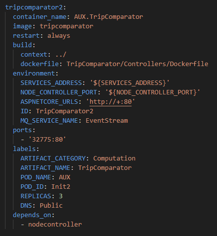
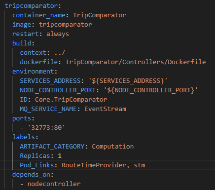
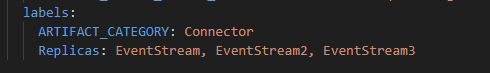
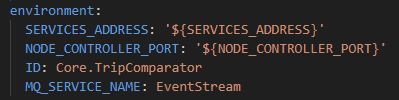
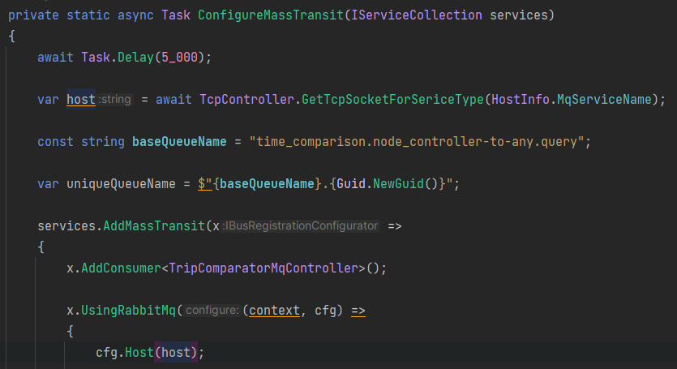
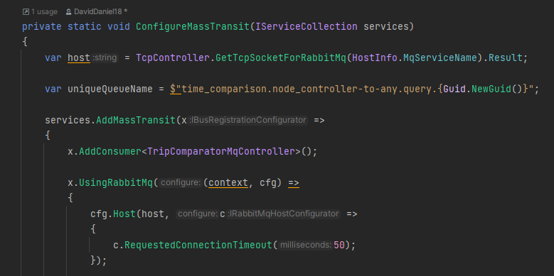
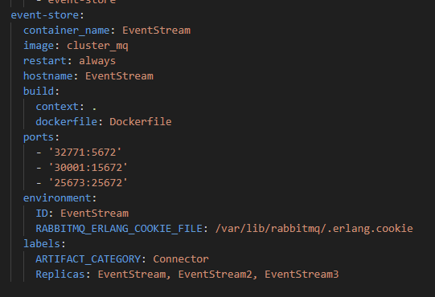
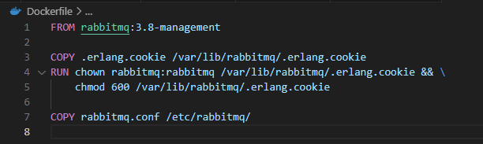
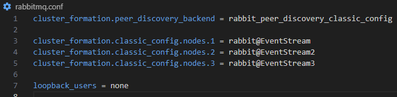

# Iteration 3 (Version mis à jour)

L'itération 3 batit sur l'itération 2, tout votre travail vous sera grandement utile pour celle-ci. Dans un effort de vous aidez, nous avons fait certaines mise à jours aux systèmes existant.

## Docker Compose
---
Le NodeController gère les conteneurs une fois ceux-ci lancés, mais il demeure dépendant des configurations faites dans docker compose. Afin de facilité la configuration de votre architecture, certains changements ont été fait à la syntaxe spécifique au laboratoire.

### Changement de syntaxe


<figure>
  
  <figcaption>Ancienne syntaxe</figcaption>
</figure>

<figure>
  
  <figcaption>Nouvelle syntaxe</figcaption>
</figure>

### Changements
- Pod_Links: Il n'est plus nécessaire de spécifier le POD_ID, POD_NAME et DNS dans chaque services. Vous pouvez simplement écrire le nom de la variable d'environement "ID" des services qui compose le pod. Le DNS du tripComparator serait automatiquement déclaré comme Public. De plus, de cette facon il est possible de définir plusieurs pods differents sans que chaque services qui les compose soit redéfinit plusieurs fois dans le compose (tripcomparator2).

- Replicas: Il est possible d'inscrire le nombre de replications du pod ou d'écrire les hostnames à assigner au service principal des pods(le systeme déduit le nombre de répliques souhaité a partir du nombre de noms). Particulierement important avec rabbitmq puisque les clusters sont formés à partir, entre autres, des hostnames.
<figure>
  
  <figcaption>3 services avec les hostnames décrit sont garantis par le nodecontroller</figcaption>
</figure>

- ARTIFACT_NAME: Ce n'est plus nécessaire! Le "ID" dans environement est désormais utilisé.

- POD_NAME: Si vous souhaiter définir un nom spécial pour votre pod, pour des raison de networking ou par soucis d'organisation, dans l'image ci-bas le pod de nom "Core" est définit dans le "ID" de environement suivit du nom du service.
<figure>
  
</figure>

- SHARE_VOLUMES: *true or false*. Par defaut ou si le label n'existe pas, c'est false. Permet de partager un même volume entre tout les replicas d'un meme type de service.
## NodeController
---
Le NodeController va subir une mise a jour significative, au moment de l'écriture de ce document, les fonctionnalités sont tous en place et les tests sont presque finit (disponible le 14 ou 15 juillet). Le but de cette mise a jour est d'alleger votre charge de travail de multiple facons pour l'itération 3.

### Nouvelles fonctionnalités

1. L4 Load Balancing / Routing: Le NodeController permettait deja de faire du service discovery et du balancement de charge sur L7 (Application - http). Puisque cette itération ci s'attaque au queues de messages et aux bases de données qui fonctionnent habituellement avec des TCP Sockets, le L7 en place ne peut pas gérer ces connections de manière approprié. Au lieu de vous forcer a déployer un load balancer à la Traefik, NGINX Plus ou autre et de le garder lui aussi en vie... Nous avons décidé d'en ajouter un au NodeController. Ce qui le rends capable autant en L7 que L4 (Transport). Pour fonctionner avec ce nouveau système si vous n'utilisez pas C#, vous devez faire un preflight au NodeController API **Routing/NegotiateSocket** avec le type de service auquel vous voulez être acheminé. La reponse est un int représentant un port. Vous vous connecteriez alors avec "**[Protocol://]host.docker.internal:[Port]**".

2. Stable Hostnames: Les hostnames des conteneurs (sauf sidecars) seront recycler dans la mesure du possible quand les services sont recréé après un kill. Ce qui vous permet d'appeler un conteneur par nom plutot qu'utilisé le NodeController ou autre pour avoir l'adresse d'un service.

<figure>
  
</figure>

### Changements de fonctionnalités

1. Le système de lecture du nouveau format Docker Compose n'est pas compatible avec l'ancienne syntaxe (bien qu'il ne va pas crasher). Si vous voulez absolument qu'il soit compatible avec les anciennes configurations, faites en part à votre chargé de lab avec une explication de votre cas spécifique.

2. Algorithm de kills est modifié pour suivre une forme sigmoïde plutot que linéaire. Ce qui nous permet de mettre le nombre de Kills/min plus bas mais d'avoir un nombre total plus élévé sur la durée du test (75 % du chiffre mis vs 50%).

3. L'API Routing/... à été changé, vous pouvez avoir l'ancien en spécifiant dans vos requêtes la version de l'Api V1. Le type retourné dans tout les cas est tout de même modifié un peu parce que 2 propriété du "RoutingData" était largement non utilisées et ils ont été remplacé par 2 nouvelles propriétés Host et Port (principalement pour les intégration dans d'autres language que C#).

4. Calcul de throughput à été changé pour prendre en compte l'aspect temporel des pannes. En fait la difference entre les messages est compté sur des périodes de 5 secondes, comme ca il ne suffit pas simplement de ratrapper le nombre de messages à la toute fin de la démo, mais d'avoir un throughput le plus stable possible tout au long. évidemment le même barême que la dernière correction ne sera pas réutilisé, nous allons l'adapté à ce nouveau critère et donc sera moins sévère. Sachez tout de même que, si nous étions dans un cas réel, il serait préférable d'avoir plusieurs indiquateurs de dispersion et d'en faire une analyse complête. Puisqu'on m'à déja demandé de fournir le code, le voici:

```
 private class MessageProcessor : IDisposable
{
    private const int IntervalToResetProcessingTime = 5_000;

    private readonly Stopwatch _processingTimeStopwatch = new();
    private readonly ConcurrentBag<double> _averageProcessingTimes = new();
    private readonly PeriodicTimer _resetTimer = new(period: TimeSpan.FromMilliseconds(IntervalToResetProcessingTime));
    private readonly CancellationTokenSource _cancellationTokenSource = new();

    private int _messageCountInCurrentInterval = 0;

    public void StartProcessing()
    {
        if (_processingTimeStopwatch.IsRunning) return;

        _processingTimeStopwatch.Start();

        _ = ResetProcessingTimesPeriodicallyAsync();
    }

    public void OnMessageProcessed()
    {
        Interlocked.Increment(ref _messageCountInCurrentInterval);
    }

    public double GetAverageOfProcessingTimes()
    {
        return _averageProcessingTimes.Average();
    }

    private async Task ResetProcessingTimesPeriodicallyAsync()
    {
        while (await _resetTimer.WaitForNextTickAsync(_cancellationTokenSource.Token))
        {
            ComputeAndStoreAverageProcessingTime();
            ResetProcessingTimeAndCount();
        }
    }

    private void ComputeAndStoreAverageProcessingTime()
    {
        var averageProcessingTimeInCurrentInterval = CalculateAverageProcessingTime();

        _averageProcessingTimes.Add(averageProcessingTimeInCurrentInterval);
    }

    private void ResetProcessingTimeAndCount()
    {
        _processingTimeStopwatch.Restart();

        Interlocked.Exchange(ref _messageCountInCurrentInterval, 0);
    }

    private double CalculateAverageProcessingTime()
    {
        return Math.Min(_processingTimeStopwatch.Elapsed.TotalMilliseconds / _messageCountInCurrentInterval, IntervalToResetProcessingTime);
    }

    public void Dispose()
    {
        _resetTimer.Dispose();
        _cancellationTokenSource.Dispose();
    }
}
```

## ServiceMeshHelper
---
Le ServiceMeshHelper à subit une mise à jour lui aussi pour deux raisons. Un tutoriel de comment mettre la version a jour sera déposé en même temps que la mise a jour du NodeController.

1. Incompatibilité avec la STM: Dû à un conflit de version de Newtonsoft entre la stm et le ServiceMeshHelper celui ci rendait le conteneur inopérable a moins de résoudre la dépendance par vous même. La nouvelle version règle ce problème en éliminant la dépendance entièrement.

2. Ajout d'un TcpController: Le ServiceMeshHelper contient un RestController pour faire des requêtes http Get et Post, mais rien pour les TCP Sockets. Ce nouveau controleur gère l'entièreté du processus pour vous en incluant le Preflight au Nodecontrolleur. Il suffit de lui fournir le **Type** de service cible pour la connection. Le host de rabbitmq devrait utilisé cette méthode.

<figure>
  
</figure>

## TripComparator
---
Si vous voulez que MassTransit rétablisse la connection rapidement après la perte d'un noeud de rabbitMq

<figure>
  
    <figcaption>c.RequestedConnectionTimeout(50) est très aggressif, mais dans notre cas c'est important de ne pas le laisser au 5 seconde avec backoff par défaut que MassTransit utilise.
    </figcaption>

</figure>

## Conseils généraux
---

- Concentrez vous sur vos algorithms de synchronisation de l'itération 2 si ceux-ci n'était pas à niveau, ils sont tout aussi important pour cette itération.

- Utilisez des Quorum queues pour RabbitMq, l'option exist dans MassTransit.

- Pas de volumes, pas de hardware failures... (faites attention aux volumes anonymes créé automatiquement comme ceux de rabbitmq)

- Pour les cluster de rabbitmq, n'oubliez pas le hostname du service créé par docker compose, sinon le cluster ne pourra pas le trouvé si vous fonctionnez par DNS. Vous devez aussi vous assurer que chaque "Node" du cluster partage le même cookie, il peut être placé dans un fichier.

<figure>
  
</figure>

- Vous pouvez batir des images docker sur des images docker...

<figure>
  
  <figcaption>Une nouvelle image est créé en batissant à partir de rabbitmq:3.8-management</figcaption>
</figure>

- Voici une config de base pour résolution de DNS dans RabbitMq
<figure>
  
</figure>

 - **Vous avez un backoff retry dans MassTransitRabbitMqClient.** Changer le pour un infinite retry avec une politique de cancelation sévère pour évité des S-Fault qui reprennent lentement (ce qui ruine le throughtput). Pour faire bref voici le code avec les modification...

```
using ApplicationLogic.Interfaces;
using Entities.DomainInterfaces;
using MassTransit;
using MqContracts;

namespace Infrastructure.Clients;

public class MassTransitRabbitMqClient : IDataStreamWriteModel
{
    private readonly IPublishEndpoint _publishEndpoint;

    public MassTransitRabbitMqClient(IPublishEndpoint publishEndpoint)
    {
        _publishEndpoint = publishEndpoint;
    }

    public async Task Produce(IBusPositionUpdated busPositionUpdated)
    {
        try
        {
            await _publishEndpoint.Publish(new BusPositionUpdated()
            {
                Message = busPositionUpdated.Message,
                Seconds = busPositionUpdated.Seconds,
            },
            x =>
            {
                x.SetRoutingKey("trip_comparison.response");
            }, new CancellationTokenSource(TimeSpan.FromMilliseconds(50)).Token);
        }
        catch
        {
            // ignored - no need to fight over ack - single message is not that important
        }
    }
}
```

## Parametres du test
---
<table>
  <tr>
    <th>Attribut</th>
    <th>Computation</th>
    <th>Connecteurs</th>
    <th>Database</th>
  </tr>
  <tr>
    <td>cpu</td>
    <td>0.25</td>
    <td>-</td>
    <td>-</td>
  </tr>
  <tr>
    <td>memory</td>
    <td>1000</td>
    <td>-</td>
    <td>-</td>
  </tr>
  <tr>
    <td>kills/min</td>
    <td>5</td>
    <td>2</td>
    <td>2</td>
  </tr>
  <tr>
    <td>hardware failures</td>
    <td>2</td>
    <td>1</td>
    <td>1</td>
  </tr>
  <tr>
    <td>max number of pods</td>
    <td>10</td>
    <td>6</td>
    <td>6</td>
  </tr>
</table>
